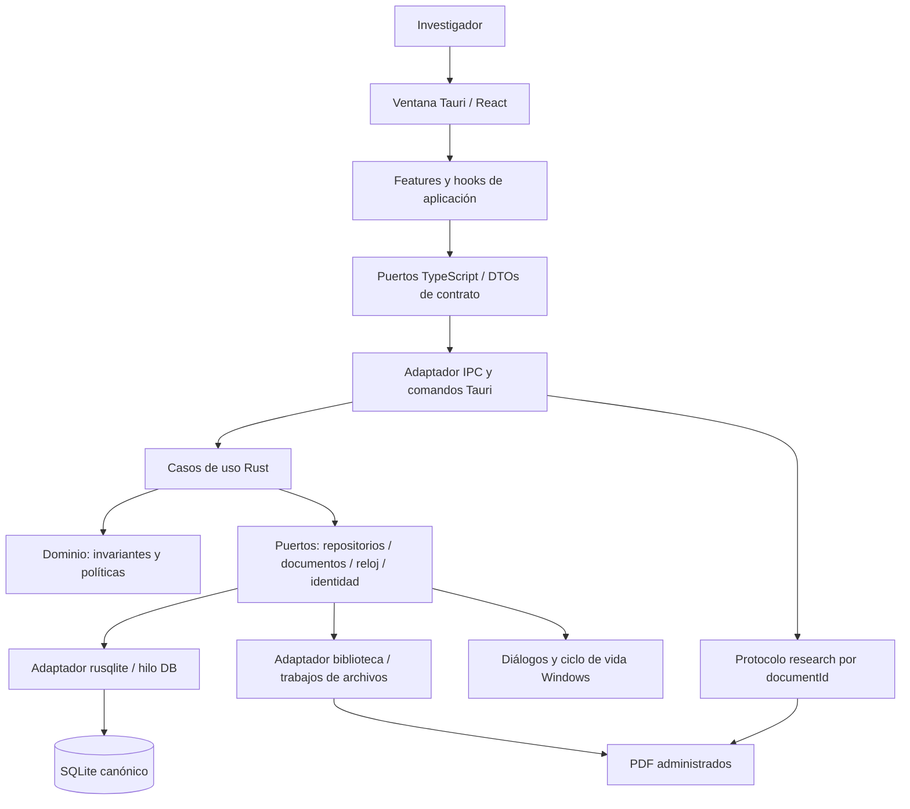
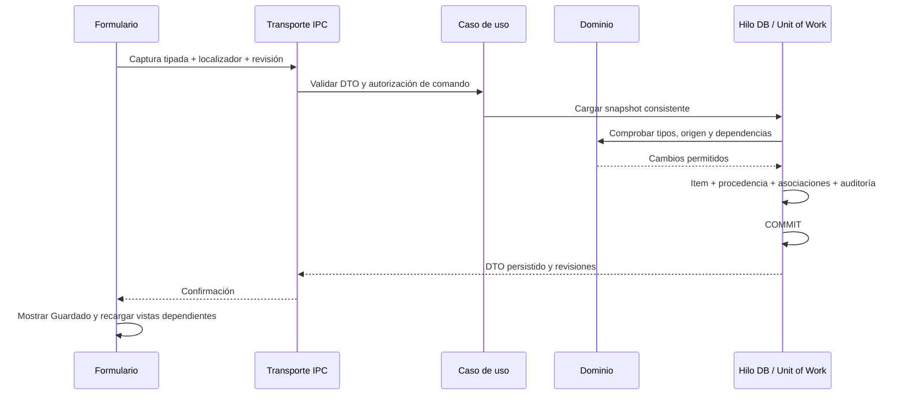

# Arquitectura de software

Estado: baseline de ejecución v0.2, adoptada el 1 de octubre de 2026 · Alcance: piloto instalable 0.0.1 y producto v0.1.0.

## 1. Forma del sistema

Research Workbench es un **monolito modular local con arquitectura hexagonal pragmática**. Tauri aloja la ventana y el núcleo Rust. React presenta información y recoge intenciones; los servicios de aplicación coordinan casos de uso; el dominio decide reglas; adaptadores concretos acceden a SQLite, documentos y sistema operativo.

Los servicios son módulos internos del mismo programa. No son procesos desplegables, endpoints REST ni microservicios. Se permite una transacción común cuando un caso de uso modifica varios módulos, por ejemplo capturar una afirmación con procedencia o invalidar fases posteriores.



## 2. Frameworks y bibliotecas seleccionadas

| Área | Selección | Responsabilidad y frontera |
|---|---|---|
| Aplicación e instalador | Tauri 2, WebView2, NSIS | Ventana, IPC, diálogo nativo y bundle Windows x64 offline |
| Presentación | React + TypeScript strict | Componentes, estado transitorio y modelos de vista tipados |
| Construcción UI | Vite | Desarrollo y producción; assets locales en el bundle |
| Sistema visual | Tailwind CSS y componentes shadcn/ui basados en Radix | Tokens comunes y controles accesibles; componentes incorporados al proyecto |
| Formularios | React Hook Form + Zod | Validación de interacción y preservación de borradores; backend vuelve a validar |
| Lectura | PDF.js | Render y selección; worker, fuentes y recursos necesarios empaquetados |
| Dominio y aplicación | Rust stable MSVC | Entidades, políticas, casos de uso y gestión de operaciones |
| Persistencia | SQLite + rusqlite con SQLite bundled y backup | SQL explícito, transacciones, backup consistente y FTS5 verificado |
| Serialización | Serde + ts-rs | DTOs Rust canónicos y TypeScript generado; sin exponer entidades DB ni rutas arbitrarias |
| Pruebas UI | Vitest + Testing Library | Interacciones, accesibilidad semántica y adaptadores de contrato |
| Pruebas núcleo | cargo test, fmt y clippy | Reglas, repositorios reales, fallos y recuperación |

Los detalles y fuentes actuales de los frameworks se recogen en ADRS. No se presupone que estén instalados o integrados. La disponibilidad de FTS5 se comprueba en la build de SQLite usada por el producto, no en la SQLite de otro programa.

El cuerpo de conocimiento es texto plano UTF-8, formato plain_text versión 1; las citas literales son campos distintos. No se añade TipTap inicialmente. La navegación usa un estado ShellView tipado que distingue Home, Library, PaperWorkspace, Knowledge y Settings; sin routing de servidor. React useState/useReducer mantiene selecciones, diálogos y borradores. No se añade Zustand, Redux, TanStack Query ni un contenedor DI en la primera versión. Si la complejidad medida lo exige, se documentará la decisión antes de añadirlos.

El caché inicial existe solo dentro del modelo de vista de cada feature. Una respuesta de mutación confirmada actualiza la vista y recarga consultas dependientes; no se duplica el almacén canónico en localStorage o IndexedDB. Los tests usan una implementación del mismo puerto que el adaptador Tauri. Las respuestas wire se validan en el adaptador con esquemas Zod tipados contra los DTO generados y fixtures de serialización; la validación de formularios no reemplaza esa frontera.

## 3. Módulos y límites

| Módulo | Posee | Depende de | No debe hacer |
|---|---|---|---|
| desktop | Inicio/cierre, bloqueo de biblioteca, ventana y rutas | Puertos OS y servicios de recuperación | Aplicar gates o editar notas |
| library | Paper, metadatos, asociación de documentos, importación | Repositorios, DocumentStore | Declarar evidencia validada por importar un PDF |
| reader | Posición y acceso controlado al documento | Documento registrado y protocolo local | Leer rutas elegidas por JavaScript |
| workflow | Definiciones versionadas, respuestas y evaluación de gates | Lecturas de biblioteca y conocimiento | Borrar contenido al volver atrás |
| knowledge | Items, Concept y asociaciones | Procedencia y repositorios | Fusionar significados automáticamente |
| relations | Extremos, contexto y semántica tipada | Catálogo y existencia/tipo de items | Interpretar una relación como prueba científica |
| provenance | Localizadores y vínculo a versión documental | Documentos y hashes | Mezclar cita literal con interpretación |
| search | Proyecciones FTS y consultas paginadas | SQLite y DTOs de resultados | Tener datos canónicos propios |
| portability | Exportación, verificación de backups y restore | Snapshot, DocumentStore y coordinador de mantenimiento | Restaurar sobrescribiendo sin validación previa |
| settings | Preferencias y biblioteca activa | Rutas OS y desktop | Cambiar biblioteca mientras hay escrituras activas |

ValidationService y el workspace P3 no se implementan todavía. La selección de candidatos P3 pertenece al contexto de trabajo de P2; no habilita una evaluación crítica ficticia.

Los módulos llaman a interfaces de aplicación declaradas. No importan adaptadores privados de otros módulos. Las consultas de infraestructura pueden hacer joins entre tablas para producir una vista; las escrituras siguen pasando por el caso de uso propietario de las invariantes.

## 4. Regla de dependencias y estructura futura

```text
src/
  app/                       # composición, ShellView, tokens y layout
  shared/contracts/          # tipos generados y validación wire
  shared/adapters/tauri/      # invoke y traducción de errores
  features/library/          # vista, hook, formulario y tests de biblioteca
  features/reader/
  features/workflow/
  features/knowledge/
  features/settings/
src-tauri/src/
  lib.rs                     # composición; registro IPC y protocolo
  domain/                    # tipos e invariantes sin Tauri ni rusqlite
  application/               # casos de uso, puertos y unidad de trabajo
  modules/                   # agrupación funcional de servicios
  adapters/sqlite/            # repositorios y migraciones
  adapters/documents/         # archivos, hash, staging, backup
  adapters/windows/           # rutas, bloqueo y diálogos
  transport/                 # DTOs, comandos y errores IPC
  desktop/                   # arranque/cierre y coordinación de mantenimiento
contracts/                   # fixtures wire y esquema generado verificable
docs/architecture/           # esta base de diseño
```

Este mapa sustituye la agrupación de archivos abreviada del plan anterior. Al redactar las tareas finales se concretan los nombres de archivos dentro de cada grupo sin alterar el contrato. No se crea todavía esta estructura en el proyecto.

Dominio depende solo de tipos de valor y bibliotecas puras necesarias. La capa de aplicación depende de dominio y puertos. Infraestructura implementa puertos. Transporte traduce DTOs a peticiones de aplicación. lib.rs compone las implementaciones concretas. No se permite importar invoke dentro de componentes ni exponer Connection, SQL, PathBuf o AppHandle a React.

## 5. Patrones escogidos y uso concreto

| Patrón | Aplicación | Límite |
|---|---|---|
| DDD táctico | Paper, procesamiento, KnowledgeItem y Concept con invariantes explícitas | Lenguaje y aggregates; no framework DDD ni burocracia por entidad |
| Puertos y adaptadores | Persistencia, archivos, reloj e identidad aislados para pruebas | Interfaces para fronteras reales; evitar traits genéricos sin consumidor |
| Application Service / Use Case | Importar, capturar con procedencia, avanzar y restaurar | Comandos delgados; reglas de dominio reutilizables |
| Repository | Consultar y persistir aggregates con control de revisión | SQL parametrizado; no repositorio CRUD genérico que salte invariantes |
| Unit of Work | Una transacción por operación estructurada | Compartida por módulos afectados; no commit oculto por repositorio |
| State Machine | Fases y operaciones de archivos con transiciones permitidas | Estados persistidos y tablas de transición, sin motor de workflow externo |
| Specification / Policy | Gate puro sobre snapshot + definición versionada | Reglas conocidas y auditables; no scripts ejecutables en plantillas |
| Optimistic concurrency | expectedRevision y actualización condicional | Rechazar edición obsoleta; no resolver conflictos con último escritor |
| Adapter / Anti-corruption layer | DTOs IPC separados de tablas y presentación | Cambio de almacenamiento no cambia automáticamente contrato |
| Command/query separation | Comandos mutan, queries devuelven DTOs | Mismo SQLite; no CQRS distribuido ni event sourcing |
| Operación recuperable | Intento durable para import, backup/restore y cambios de raíz | Compensación verificable; no transacción ficticia SQLite+filesystem |

Los eventos de auditoría se insertan en la misma transacción que el cambio. No se incorpora event bus; invalidación de vistas y marcas NEEDS_REVIEW se coordinan explícitamente. El historial es auditoría de estado, no la fuente desde la que reconstruir todo el sistema.

## 6. Ejecución, concurrencia y operaciones largas

Una conexión rusqlite pertenece a un hilo dedicado DB. Los comandos Tauri esperan respuestas de forma asíncrona; el hilo de ventana no hace SQL, hashing, render de PDF ni copias. La decisión evita compartir una Connection a través de llamadas concurrentes; las propiedades de Connection se documentan en la [referencia de rusqlite](https://docs.rs/rusqlite/latest/rusqlite/struct.Connection.html).

La cola DB tiene capacidad inicial 64 trabajos. Si no admite un trabajo, devuelve error recuperable de ocupación definido en CONTRACTS; no crece sin límite. Cada trabajo contiene una operación tipada y respuesta propia. Una transacción corta agrupa las escrituras del caso de uso. No se mantiene una transacción durante copia o hash de PDFs.

Los trabajos de archivos usan ejecución bloqueante en background y tokens de operación. Tauri ofrece [spawn_blocking](https://docs.rs/tauri/latest/tauri/async_runtime/fn.spawn_blocking.html); el uso de un hilo DB y las políticas de cancelación son decisiones de este diseño. Cancelar solicita detenerse en un punto seguro; nunca se supone que abandonar una Promise revierta un commit.

Un coordinador de mantenimiento impide nuevas mutaciones mientras obtiene una instantánea, migra, restaura o cambia biblioteca. Antes drena operaciones aceptadas o las deja en un estado recuperable. Al salir, publica la nueva raíz y revisiones de forma coherente. Una segunda instancia no adquiere la biblioteca activa para escribir.

## 7. Recorridos entre módulos



Avanzar fase sigue la misma regla: cargar definición fijada y estado actual, reevaluar gate dentro de la operación, confirmar transición e historial juntos. Un evaluateGate anterior sirve para orientación, no como token de autorización permanente.

Importar usa intención durable, staging, hash, promoción y commit final; el detalle está en DATA. Exportar y respaldar trabajan desde snapshots para que relaciones, respuestas y archivos correspondan a la misma generación. Restaurar usa una raíz preparada y validada y un cambio recuperable, no copiar sobre una biblioteca abierta.

## 8. Seguridad, distribución y evolución

El frontend no se considera una frontera de validación suficiente. Comandos aceptan IDs y DTOs limitados. Los diálogos nativos otorgan tokens específicos a archivos elegidos; ninguna cadena de ruta recibida permite lectura general. El protocolo research sirve únicamente documentId registrados dentro de la raíz canónica, con comprobación de escapes y reparse points.

La ventana autorizada se etiqueta main. Una capability main-local permite exclusivamente los grupos de comandos propios research-read, research-write y research-maintenance, extraídos del registry cerrado de CONTRACTS. research-read contiene consultas sin efectos; research-write contiene mutaciones bibliográficas, de lectura, workflow y conocimiento; research-maintenance contiene importación, comprobación de hashes, export/backup/restore y cambio de raíz. Seleccionar un archivo no concede lectura genérica: pertenece al comando de aplicación que devuelve un token. No se conceden permisos JavaScript genéricos de fs, shell, SQL, HTTP, creación de ventanas o acceso remoto. Los diálogos se utilizan desde Rust, no mediante una API libre de frontend.

El manifest de tauri-build declara todos los comandos de aplicación para que sus permisos sean explícitos; los archivos TOML de permisos utilizan commands.allow y la capability aplica solo a main, sin remote.urls. La build debe verificar que un comando fuera de los grupos o desde otra ventana se rechaza. Son mecanismos documentados en [Permissions](https://v2.tauri.app/security/permissions/), [Capabilities](https://v2.tauri.app/security/capabilities/) y [AppManifest](https://docs.rs/tauri-build/latest/tauri_build/struct.AppManifest.html); las listas concretas se derivan del registry, no de wildcards.

La CSP de release admite scripts y workers empaquetados del propio origen, estilos locales —con inline únicamente donde los componentes lo necesiten—, imágenes data/blob utilizadas por el lector, fuentes locales y las conexiones IPC/custom protocol necesarias. Deniega scripts remotos, unsafe-eval JavaScript, objetos y frames. ADR-015 permite únicamente wasm-unsafe-eval para los decodificadores WASM empaquetados de PDF.js y connect-src self para sus recursos locales; no autoriza scripting del PDF. El adaptador no incorpora servidores localhost de desarrollo a la CSP de release. Se registra la CSP resuelta de la build para comprobar los orígenes exactos que Tauri utiliza en Windows, sin abrir connect-src a todos los hosts. El texto científico siempre se presenta escapado; no se activa JavaScript embebido del PDF y los enlaces externos solo se abren por una acción explícita del usuario.

La protección debe activarse en la configuración; Tauri añade elementos necesarios a la CSP al empaquetar. La [guía oficial CSP](https://v2.tauri.app/security/csp/) fundamenta esa configuración y el test inspecciona el resultado de release.

Las bibliotecas están en disco local; no se soporta SQLite activo en carpetas de red o sincronización como OneDrive. Un backup exportado sí puede copiarse allí. La propia aplicación no envía investigación ni telemetría. La integridad local no garantiza confidencialidad frente a otra cuenta/proceso con permisos de lectura del sistema operativo.

La entrega Windows está regida por ADR-011 y SPEC-001. Los binarios, datos, backups y código tienen rutas independientes. No hay servidor residente ni autoinicio predeterminado. Mantener recursos locales y CSP limitada forma parte del gate de instalación.

Una futura integración LLM tendrá un puerto independiente, consentimiento para envío de datos y propuestas separadas del conocimiento confirmado. No se introduce ahora ese runtime. P3/P4, editor enriquecido, caché avanzada o multiplataforma requieren ADR/SPEC y contrato nuevo o compatible antes de implementación.


