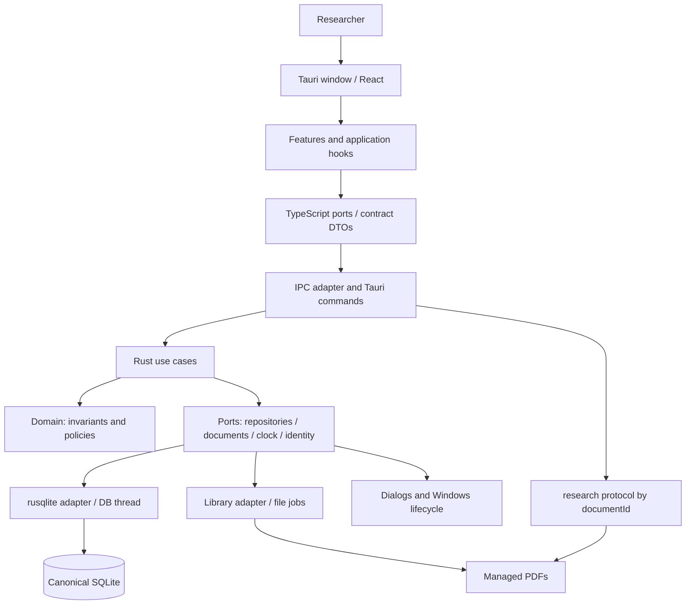
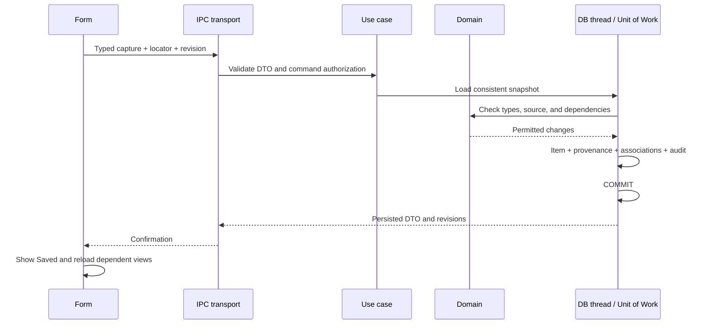

# Software architecture

Status: implementation baseline v0.2, adopted on 1 October 2026 · Scope: installable pilot 0.0.1 and product v0.1.0.

## 1. System form

Research Workbench is a **local modular monolith with pragmatic hexagonal architecture**. Tauri hosts the window and Rust core. React presents information and captures user intent; application services coordinate use cases; the domain enforces rules; concrete adapters access SQLite, documents, and the operating system.

Services are internal modules within the same program. They are not separately deployed processes, REST endpoints, or microservices. A use case may use one transaction when it changes several modules, for example when capturing a claim with provenance or invalidating later phases.



## 2. Selected frameworks and libraries

| Area | Selection | Responsibility and boundary |
|---|---|---|
| Application and installer | Tauri 2, WebView2, NSIS | Window, IPC, native dialog, and offline Windows x64 bundle |
| Presentation | React + strict TypeScript | Components, transient state, and typed view models |
| UI build | Vite | Development and production builds; local assets in the bundle |
| Visual system | Tailwind CSS and shadcn/ui components based on Radix | Shared tokens and accessible controls; components are included in the project |
| Forms | React Hook Form + Zod | Interaction validation and draft preservation; the backend validates again |
| Reading | PDF.js | Rendering and selection; the worker, fonts, and required resources are packaged |
| Domain and application | Stable Rust with MSVC | Entities, policies, use cases, and operation management |
| Persistence | SQLite + rusqlite with bundled SQLite and backup support | Explicit SQL, transactions, consistent backups, and verified FTS5 |
| Serialization | Serde + ts-rs | Canonical Rust DTOs and generated TypeScript; database entities and arbitrary paths are not exposed |
| UI tests | Vitest + Testing Library | Interactions, semantic accessibility, and contract adapters |
| Core tests | cargo test, fmt, and clippy | Rules, real repositories, failures, and recovery |

The current framework details and sources are collected in ADRS. The project does not assume that these frameworks are installed or integrated. FTS5 availability is checked in the SQLite build used by the product, not in another program's SQLite build.

The knowledge body is UTF-8 plain text in plain_text version 1 format; literal citations are separate fields. TipTap is not included initially. Navigation uses a typed ShellView state with Home, Library, PaperWorkspace, Knowledge, and Settings; it does not use server-side routing. React useState/useReducer manages selections, dialogs, and drafts. Zustand, Redux, TanStack Query, and a DI container are not included in the first version. If measured complexity requires them, the decision will be documented before they are added.

The initial cache exists only in each feature's view model. A confirmed mutation response updates the view and reloads dependent queries; the canonical store is not duplicated in localStorage or IndexedDB. Tests use an implementation of the same port as the Tauri adapter. Wire responses are validated in the adapter with Zod schemas typed against the generated DTOs and serialization fixtures; form validation does not replace that boundary.

## 3. Modules and boundaries

| Module | Owns | Depends on | Must not |
|---|---|---|---|
| desktop | Startup/shutdown, library lock, window, and routes | OS ports and recovery services | Apply gates or edit notes |
| library | Paper, metadata, document association, and import | Repositories, DocumentStore | Declare evidence validated merely because a PDF was imported |
| reader | Position and controlled document access | Registered document and local protocol | Read paths selected by JavaScript |
| workflow | Versioned definitions, answers, and gate evaluation | Library readings and knowledge | Delete content when moving back |
| knowledge | Items, Concept, and associations | Provenance and repositories | Merge meanings automatically |
| relations | Endpoints, context, and typed semantics | Catalogue and item existence/type | Treat a relation as scientific proof |
| provenance | Locators and links to document versions | Documents and hashes | Mix literal quotations with interpretation |
| search | FTS projections and paginated queries | SQLite and result DTOs | Own canonical data |
| portability | Export, backup verification, and restore | Snapshot, DocumentStore, and maintenance coordinator | Restore by overwriting without prior validation |
| settings | Preferences and active library | OS paths and desktop | Change the library while writes are active |

ValidationService and the P3 workspace are not implemented yet. Selecting P3 candidates belongs to the P2 work context; it does not enable a fictitious critical assessment.

Modules call declared application interfaces. They do not import private adapters from other modules. Infrastructure queries may join tables to produce a view; writes still go through the use case that owns the invariants.

## 4. Dependency rule and future structure

```text
src/
  app/                       # composition, ShellView, tokens, and layout
  shared/contracts/          # generated types and wire validation
  shared/adapters/tauri/     # invoke and error translation
  features/library/          # library view, hook, form, and tests
  features/reader/
  features/workflow/
  features/knowledge/
  features/settings/
src-tauri/src/
  lib.rs                     # composition; IPC and protocol registration
  domain/                    # types and invariants without Tauri or rusqlite
  application/               # use cases, ports, and unit of work
  modules/                   # functional grouping of services
  adapters/sqlite/           # repositories and migrations
  adapters/documents/        # files, hashes, staging, backups
  adapters/windows/          # paths, locking, and dialogs
  transport/                 # DTOs, commands, and IPC errors
  desktop/                   # startup/shutdown and maintenance coordination
contracts/                   # wire fixtures and verifiable generated schema
docs/architecture/           # this design baseline
```

This map replaces the abbreviated file grouping in the previous plan. Final task definitions will specify filenames within each group without changing the contract. This structure has not yet been created in the project.

The domain depends only on required value types and pure libraries. The application layer depends on the domain and ports. Infrastructure implements the ports. Transport maps DTOs to application requests. lib.rs composes concrete implementations. Components must not import invoke, and Connection, SQL, PathBuf, or AppHandle must not be exposed to React.

## 5. Selected patterns and concrete use

| Pattern | Application | Boundary |
|---|---|---|
| Tactical DDD | Paper, processing, KnowledgeItem, and Concept with explicit invariants | Domain language and aggregates; no DDD framework or entity-by-entity bureaucracy |
| Ports and adapters | Persistence, files, clock, and identity isolated for tests | Interfaces at real boundaries; avoid generic traits with no consumers |
| Application Service / Use Case | Import, capture with provenance, advance, and restore | Thin commands; reusable domain rules |
| Repository | Query and persist aggregates with revision control | Parameterized SQL; no generic CRUD repository that bypasses invariants |
| Unit of Work | One transaction per structured operation | Shared by affected modules; repositories do not hide commits |
| State Machine | Phases and file operations with permitted transitions | Persisted states and transition tables; no external workflow engine |
| Specification / Policy | Pure gate over a snapshot and versioned definition | Known, auditable rules; no executable scripts in templates |
| Optimistic concurrency | expectedRevision and conditional update | Reject stale edits; do not resolve conflicts with last-writer-wins |
| Adapter / Anti-corruption layer | IPC DTOs separate from tables and presentation | Storage changes do not automatically change the contract |
| Command/query separation | Commands mutate; queries return DTOs | Same SQLite database; no distributed CQRS or event sourcing |
| Recoverable operation | Durable intent for import, backup/restore, and root changes | Verifiable compensation; no fictitious SQLite-plus-filesystem transaction |

Audit events are inserted in the same transaction as the change. No event bus is added; view invalidation and NEEDS_REVIEW flags are coordinated explicitly. History is an audit of state, not a source from which to rebuild the entire system.

## 6. Execution, concurrency, and long-running operations

A dedicated DB thread owns the rusqlite connection. Tauri commands await responses asynchronously; the window thread does not perform SQL, hashing, PDF rendering, or file copies. This avoids sharing a Connection across concurrent calls; Connection properties are documented in the [rusqlite reference](https://docs.rs/rusqlite/latest/rusqlite/struct.Connection.html).

The DB queue initially holds 64 jobs. If it cannot accept a job, it returns the recoverable busy error defined in CONTRACTS; the queue does not grow without limit. Each job carries a typed operation and its own response. A short transaction groups a use case's writes. A transaction is never held open while copying or hashing PDFs.

File jobs use blocking background execution and operation tokens. Tauri provides [spawn_blocking](https://docs.rs/tauri/latest/tauri/async_runtime/fn.spawn_blocking.html); using a DB thread and defining cancellation policies are decisions in this design. Cancellation requests a stop at a safe point; abandoning a Promise is never assumed to roll back a commit.

A maintenance coordinator prevents new mutations while taking a snapshot, migrating, restoring, or changing the library. It first drains accepted operations or leaves them in a recoverable state. On exit, it publishes the new root and revisions consistently. A second instance cannot acquire the active library for writing.

## 7. Cross-module flows



Phase advancement follows the same rule: load the pinned definition and current state, reevaluate the gate within the operation, and commit the transition and history together. A prior evaluateGate result is guidance, not a permanent authorization token.

Import uses durable intent, staging, hashing, promotion, and final commit; details are in DATA. Export and backup work from snapshots so relations, answers, and files belong to the same generation. Restore uses a prepared and validated root plus a recoverable switch; it does not copy over an open library.

## 8. Security, distribution, and evolution

The frontend is not a sufficient validation boundary. Commands accept IDs and bounded DTOs. Native dialogs grant specific tokens for selected files; no path string received from the frontend permits general file access. The research protocol serves only registered documentIds inside the canonical root, with checks against path escapes and reparse points.

The authorized window is labelled main. A main-local capability allows only the research-read, research-write, and research-maintenance command groups defined by the closed registry in CONTRACTS. research-read contains queries without side effects; research-write contains bibliographic, reading, workflow, and knowledge mutations; research-maintenance contains import, hash checks, export/backup/restore, and root changes. Selecting a file does not grant generic read access; it is handled by the application command that returns a token. Generic JavaScript permissions for fs, shell, SQL, HTTP, window creation, or remote access are not granted. Dialogs are used from Rust, not through an unrestricted frontend API.

The tauri-build manifest declares all application commands so their permissions are explicit; TOML permission files use commands.allow, and the capability applies only to main, with no remote.urls. The build must verify that a command outside these groups, or a command from another window, is rejected. These mechanisms are documented in [Permissions](https://v2.tauri.app/security/permissions/), [Capabilities](https://v2.tauri.app/security/capabilities/), and [AppManifest](https://docs.rs/tauri-build/latest/tauri_build/struct.AppManifest.html); concrete lists derive from the registry, not wildcards.

The release CSP allows scripts and workers bundled from the application origin, local styles—with inline styles only where components require them—data/blob images used by the reader, local fonts, and the IPC/custom-protocol connections required by the app. It denies remote scripts, JavaScript unsafe-eval, objects, and frames. ADR-015 allows wasm-unsafe-eval only for bundled PDF.js WASM decoders and connect-src self for its local resources; it does not authorize PDF scripting. The release CSP does not include localhost development servers. The resolved build CSP is recorded to check the exact origins Tauri uses on Windows, without opening connect-src to every host. Scientific text is always rendered as escaped text; embedded PDF JavaScript is not enabled, and external links open only after an explicit user action.

Protection must be enabled in configuration; Tauri adds required entries to the CSP when bundling. The [official CSP guide](https://v2.tauri.app/security/csp/) informs this configuration, and the test inspects the release result.

Libraries reside on local disks; active SQLite libraries in network or synced folders such as OneDrive are unsupported. An exported backup may be copied there. The application does not send research data or telemetry. Local integrity does not guarantee confidentiality from another account or process with operating-system read permissions.

The Windows delivery follows ADR-011 and SPEC-001. Binaries, data, backups, and source code use separate paths. There is no resident server or default auto-start. Keeping resources local and the CSP restricted are part of the installation gate.

A future LLM integration will use an independent port, require consent to send data, and keep suggestions separate from confirmed knowledge. No such runtime is introduced now. P3/P4, a rich-text editor, advanced caching, or cross-platform support require a new or compatible ADR/SPEC and contract before implementation.
