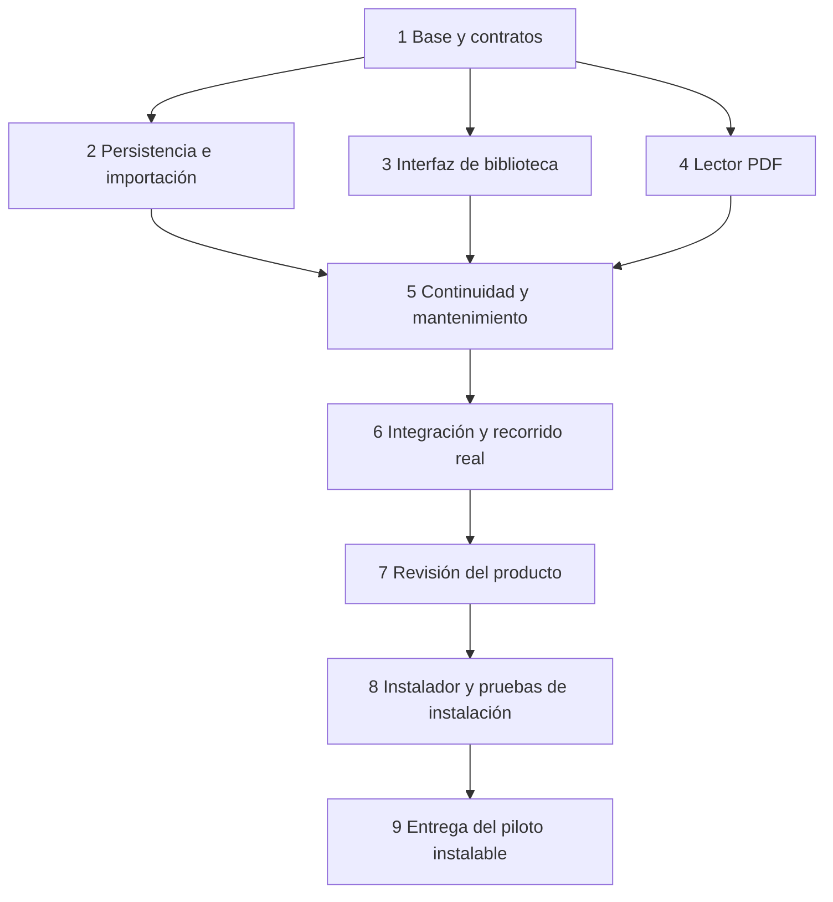

# Research Workbench: plan desktop instalable y desarrollo multiagente

> **For agentic workers:** REQUIRED SUB-SKILL: Use superpowers:subagent-driven-development to implement this plan task-by-task. Steps use checkbox syntax for tracking.

**Goal:** Construir el primer incremento de Research Workbench como aplicación de escritorio Windows instalable mediante setup.exe, ejecutable desde Inicio y capaz de importar, conservar, abrir y reanudar papers PDF sin herramientas de desarrollo en el equipo de uso.

**Architecture:** Tauri 2 aloja React y TypeScript. Los servicios Rust aplican reglas y gestionan una biblioteca de archivos con SQLite como autoridad. Codex coordina agentes nativos con contratos comunes y responsabilidad de integración centralizada.

**Tech Stack:** Tauri 2, React, TypeScript, Vite, SQLite mediante rusqlite, PDF.js, Vitest y Testing Library; pruebas Rust con cargo test y bibliotecas temporales.

**Spec:** La visión se conserva en Research_Workbench_Arquitectura_y_Especificacion_v0.1.docx. La base normativa previa a código es ahora [ResearchWorkbench_Arquitectura/README.md](ResearchWorkbench_Arquitectura/README.md), con ARCHITECTURE, DOMAIN, CONTRACTS, DATA, SPECS, ADRS y QUALITY. Su contenido se copiará a docs/architecture/ al iniciar el proyecto.

**Proyecto acordado:** C:\Users\david\Projects\Research-Workbench.

**Estado al 1 de octubre de 2026:** plan preparado; código de producto y repositorio aún no creados. Tres agentes Luna han revisado backend, interfaz y entorno. La implementación comienza tras revisión de este plan y autorización para instalar el requisito Rust que falta.

**Gate arquitectónico previo:** revisar y aceptar la base de arquitectura escrita, registrar ADRs aceptados y alinear las tareas con los contratos normativos antes de ejecutar tarea 1. Las firmas abreviadas y nombres de archivos de este plan reflejan su primera descomposición: CONTRACTS y ARCHITECTURE son ahora la autoridad para sus revisiones. No se delegan tareas con firmas antiguas ni se considera el scaffolding una forma de resolver decisiones pendientes.

## Restricciones globales

- Aplicación de escritorio Windows, local y de un solo usuario.
- El primer piloto se entrega instalado: setup.exe, ventana propia, accesos directos y desinstalador. Compilar o abrir una ventana de desarrollo no satisface la entrega.
- Sin login, usuarios internos, servidor remoto, cloud obligatoria ni API HTTP.
- Tauri 2 + React + TypeScript + Rust + SQLite.
- SQLite es la fuente de verdad y los PDF se copian a una biblioteca administrada.
- UUID estables y rutas de documentos relativas a la biblioteca.
- Guardado confirmado solo después de commit persistente.
- PRE → P1 → P2 es el alcance funcional de v0.1; P3 y P4 se implementan después.
- El primer incremento de este plan entrega biblioteca y lectura; no se anuncia como v0.1 terminada.
- Los agentes ayudan a desarrollar la aplicación. La aplicación v0.1 no integra agentes ni LLMs.
- La interfaz y los errores orientados al usuario se presentan en español.
- Todo test destructivo o de interrupción usa una biblioteca temporal y archivos de prueba.
- No se modifica la configuración global de Codex ni otros proyectos.

## Contrato de entrega como aplicación desktop

La plataforma inicial será Windows 11 x64. Cada versión utilizable, incluido el piloto 0.0.1, tendrá un instalador NSIS generado por Tauri. La versión 0.1.0 identificará el alcance PRE → P2 completo y verificado. Otras arquitecturas y sistemas operativos requieren builds y pruebas propias antes de anunciar compatibilidad.

| Aspecto | Decisión de producto y criterio verificable |
|---|---|
| Instalación | Abrir Research-Workbench_<version>_x64-setup.exe, instalar para el usuario actual y registrar Research Workbench en Aplicaciones instaladas de Windows |
| Inicio | Acceso en el menú Inicio; acceso al escritorio opcional; ambos apuntan al ejecutable instalado |
| Ejecución | Ventana propia con título e icono, sin consola visible, navegador externo ni pasos técnicos para abrirla |
| Recursos | Interfaz, estilos, fuentes utilizadas, PDF.js y su worker empaquetados; sin CDN ni servidor de desarrollo durante el uso |
| Dependencias de uso | WebView2 proporcionado por el instalador cuando falte; el usuario final no instala Node, npm, Rust, Cargo, Git ni Codex |
| Conectividad | Instalación y captura/lectura local posibles sin internet; no se solicita cuenta ni clave API |
| Cierre | La ventana cierra el proceso tras resolver el guardado; no queda un servicio residente ni se activa arranque con Windows por defecto |
| Actualización | Ejecutar un instalador de versión posterior conserva la misma biblioteca y migra el esquema con protección previa |
| Desinstalación | Retira programa y accesos; conserva biblioteca y copias de seguridad. Reinstalar permite retomarla |

El formato principal es NSIS setup.exe; MSI y una edición portable quedan fuera del primer alcance. El instalador utiliza modo currentUser. La ruta prevista de binarios es %LOCALAPPDATA%\Programs\Research Workbench; ningún componente debe asumir esa ruta para localizar los datos. El identificador de aplicación será estable, local.researchworkbench.desktop, y no cambiará entre versiones. Los nombres finales del archivo y ejecutable se registrarán al generar el bundle, sin hacer depender el producto del nombre que produzca una versión del empaquetador.

Para permitir instalación offline se elige webviewInstallMode.type = offlineInstaller. Esto aumenta el tamaño del paquete; se medirá el instalador real antes de fijar un presupuesto de tamaño. La obtención de dependencias durante el desarrollo y la construcción sí puede requerir internet. En equipos con restricciones corporativas o un fallo del runtime, el instalador debe explicar la incidencia y permitir reintentar, conservando los datos.

Fragmento previsto de tauri.conf.json, a combinar con la configuración del proyecto y validar con la versión fijada de Tauri:

```json
{
  "productName": "Research Workbench",
  "version": "0.0.1",
  "identifier": "local.researchworkbench.desktop",
  "bundle": {
    "active": true,
    "targets": ["nsis"],
    "windows": {
      "allowDowngrades": false,
      "webviewInstallMode": { "type": "offlineInstaller" },
      "nsis": {
        "installMode": "currentUser",
        "languages": ["Spanish"],
        "startMenuFolder": "Research Workbench"
      }
    }
  }
}
```

El acceso opcional al escritorio se verificará en el instalador generado; si necesita personalización, se utilizarán los mecanismos NSIS documentados y se revisarán sus scripts. No se añadirá una clave de configuración inexistente para prometer esa opción.

El piloto es de distribución local y no se promete firma Authenticode. Antes de distribución pública habrá una decisión específica sobre certificado y editor; una build sin firma puede mostrar avisos de confianza de Windows. El plan no incluye subir paquetes ni contratar servicios. Las actualizaciones serán manuales inicialmente; un actualizador remoto y su infraestructura se evaluarán después.

## Almacenamiento y ciclo de vida del programa instalado

| Ubicación | Contenido | Tratamiento |
|---|---|---|
| C:\Users\david\Projects\Research-Workbench | Código y herramientas de desarrollo | No es necesaria para usar la app instalada |
| Carpeta de instalación | Ejecutable, recursos y desinstalador | Reemplazable en actualización; retirada al desinstalar |
| %LOCALAPPDATA%\ResearchWorkbench\library | SQLite, PDF administrados, estado de lectura y operaciones recuperables | Independiente del ejecutable y de la versión; se conserva al actualizar y desinstalar |
| %LOCALAPPDATA%\ResearchWorkbench\backups | Copias internas previas a migración, con manifiesto | Conservadas al desinstalar; no sustituyen un backup en otro disco |
| %LOCALAPPDATA%\ResearchWorkbench\logs | Diagnóstico local limitado y rotado | No contiene texto de papers, notas ni contenidos PDF por defecto |

La biblioteca y los backups internos no se guardan junto al código ni en la carpeta del programa. En este primer corte la ubicación predeterminada se muestra en Preferencias junto a la versión instalada; cambiar biblioteca y gestionar backups de usuario se incorporan en el incremento 4. La pantalla inicial explica que los PDF se copian a la biblioteca local.

**Arranque:** adquirir bloqueo exclusivo de la biblioteca, comprobar compatibilidad del esquema antes de escribir, aplicar migraciones protegidas si corresponde, reconciliar imports interrumpidos y abrir Home con Continuar leyendo. Una segunda apertura enfoca la ventana existente o informa que la biblioteca está en uso; no habilita otro escritor. El bloqueo debe liberarse al morir el proceso sin obligar a borrar archivos manualmente.

**Cierre:** detener nuevas mutaciones, confirmar cambios de página y estado pendientes, esperar o cancelar de forma recuperable imports en curso y cerrar SQLite. Si un guardado falla, mantener la ventana y ofrecer Reintentar o Cerrar sin guardar ese cambio, sin señalar Guardado. Un cierre forzado conserva lo ya confirmado y deja operaciones pendientes para reconciliación; no se promete conservar un cambio que aún no fue confirmado. Nunca ejecutar bloqueos indefinidos en el hilo de la ventana.

**Actualización manual:** cerrar el programa y ejecutar el nuevo instalador. El reemplazo de binarios no borra ni crea otra biblioteca por número de versión. En el siguiente arranque, antes de una migración, crear una copia consistente con la API de backup de SQLite, archivos administrados necesarios, estado recuperable y manifiesto con versión y hashes, bajo exclusión de escrituras. No copiar solo el archivo SQLite mientras WAL esté activo. Si faltan espacio o permisos, abortar la migración y explicar cómo resolverlo. Aplicar migraciones versionadas y verificadas en transacción; ante fallo, conservar la biblioteca anterior y registrar el error sin permitir escrituras sobre un esquema parcial. La recuperación se prueba sobre copias temporales.

**Versión incompatible:** tanto el instalador como el backend rechazan downgrades incompatibles. Si el esquema es más nuevo que el soportado, la app no lo modifica y pide una versión compatible. No se restaura automáticamente un backup ni se promete que un ejecutable anterior pueda abrir un esquema ya migrado.

**Desinstalación y reinstalación:** el desinstalador elimina exclusivamente los componentes del programa y sus accesos. No ofrece borrar investigación en el piloto. Los datos permanecen en la ubicación documentada y reinstalar los abre de nuevo si el esquema es compatible. Cualquier futura función de eliminación de biblioteca será una acción separada y explícita.

## Enfoque y responsabilidad

El coordinador GPT-6.1 Sol con razonamiento high mantiene arquitectura, contratos, descomposición, configuración compartida, integración y aceptación. Los implementadores GPT-6 Luna con razonamiento medium resuelven tareas acotadas. Se limita a tres subagentes concurrentes; no se crea un orquestador Python ni un SDK propio.

Una alternativa sería implementar todo con un único agente, lo que reduce coordinación pero pierde revisión y paralelismo. Un harness propio añadiría aislamiento programático y scheduling a cambio de trabajo adicional. Se elige el multiagente nativo de Codex porque satisface el objetivo actual y ya está disponible en esta sesión.

Los agentes nativos de esta sesión comparten filesystem. El límite de concurrencia no crea automáticamente worktrees. Para la primera ejecución se usan archivos disjuntos y el coordinador controla los ficheros compartidos. Si una tarea requiere editar superficies compartidas o experimentar con cambios amplios, el coordinador crea un worktree Git específico y da al worker una raíz absoluta; esa separación organiza cambios, pero no reemplaza permisos del runtime.

Cada asignación contiene tarea, contexto mínimo, contratos, archivos propios, archivos prohibidos, dependencias y comprobaciones. El agente devuelve archivos cambiados, comandos ejecutados, resultado, supuestos y limitaciones. No delega cambios arquitectónicos ni altera el contrato unilateralmente.

Los workers no están solos: no deben revertir cambios ajenos, modificar lockfiles compartidos, migraciones de otro agente o ejecutar instalaciones simultáneas. El coordinador instala dependencias, fija versiones y actualiza lockfiles una sola vez.

## Configuración de Codex prevista

Este bloque se guardará únicamente en .codex/config.toml del proyecto cuando comience la implementación:

```toml
model = "gpt-6.1-sol"
model_reasoning_effort = "high"

[agents]
enabled = true
default_subagent_model = "gpt-6-luna"
default_subagent_reasoning_effort = "medium"
max_concurrent_threads_per_session = 3
```

La clave max_threads del hilo anterior es un alias antiguo. Se usa el nombre documentado actual. Codex CLI instalado es 0.159.2, y el diagnóstico con --strict-config y las cuatro opciones agents anteriores terminó sin fallo de configuración. Esto verifica lectura de configuración; la ejecución real de tres agentes Luna en este chat verifica la capacidad de delegar. La futura sesión del CLI se comprueba de nuevo desde el proyecto, teniendo en cuenta su estado de confianza.

La revisión usa agentes independientes adecuados al código cambiado, incluidos los revisores Rust y TypeScript y una revisión general. El coordinador conserva la decisión final. Su modelo previsto es Sol; no se sustituye por otro sin una razón explícita.

AGENTS.md del proyecto recogerá estas reglas y remitirá a docs/PRODUCT.md, docs/CONTRACTS.md y docs/STATUS.md. Los roles personalizados, si se necesitan, se definirán en TOML bajo .codex/agents con name, description y developer_instructions; no se inventarán claves de configuración.

## Entorno comprobado

| Requisito | Resultado | Acción prevista |
|---|---|---|
| Codex CLI | 0.159.2 y multi_agent activo | Utilizar el instalado |
| Node | v24.14.1 | Utilizarlo para este proyecto |
| npm | 11.11.0 | Instalar dependencias locales del proyecto |
| Git | 2.43.0.windows.1 | Inicializar repositorio local |
| C++ para Windows | VS 2022 Community 17.9.2 con componente VC.Tools.x86.x64 | Utilizar el existente |
| WebView2 | 154.0.4258.48 | Utilizar el existente |
| Rust y Cargo | No encontrados en PATH ni en la ubicación estándar | Instalar toolchain stable MSVC con rustup tras autorización |

La instalación de Rust se limita al usuario actual, sin reinstalar Visual Studio ni WebView2. Se comprobará rustc, cargo y el target MSVC antes de compilar. Las dependencias del producto se instalan en el proyecto, no globalmente. No se actúa sobre avisos ajenos de Codex detectados durante el diagnóstico.

## Primer incremento y aceptación

El usuario instala el piloto con setup.exe y abre Research Workbench desde Inicio. Importa un PDF, completa o marca desconocidos sus metadatos, ve el paper en Biblioteca y lo lee dentro de la aplicación. Puede cerrar, volver a abrir desde su acceso, reanudar en la última página y archivar o restaurar el paper. Mover el PDF original o retirar la carpeta del código fuente no impide leer la copia administrada.

No se incluyen borrado permanente, fusión de conceptos, conocimiento tipado, gates de fase, gestión de backups de usuario, exportación ni búsqueda FTS en este corte. Se incorporan en incrementos posteriores antes de declarar v0.1 lista para uso habitual. Sí se incluye protección interna previa a migraciones, necesaria para actualizar desde el primer piloto. El primer corte se prueba con una biblioteca piloto separada de los documentos de investigación originales.

La aceptación incluye instalar en Windows 11 x64 sin herramientas de desarrollo, abrir sin red, completar el recorrido, actualizar conservando los datos y desinstalar/reinstalar retomando la biblioteca. Tener una build compilada, un visor en navegador o tests con mocks no sustituye estas comprobaciones del producto instalado.

## Decisiones del primer incremento

1. Biblioteca por defecto en %LOCALAPPDATA%/ResearchWorkbench/library. La raíz la determina Rust y no se acepta una ruta arbitraria enviada por la UI. La selección de otra biblioteca se añade antes de cerrar v0.1.
2. Metadatos: título no vacío; autores pueden faltar; año puede ser NULL o un entero de cuatro cifras; reviewType acepta survey, topical_review, slr, mapping_study, tutorial, other y unknown. No se inventa DOI, fecha o autor ausente.
3. DOI: trim, quitar prefijos doi: y https://doi.org/ o http://doi.org/, comparar sin distinguir mayúsculas y exigir forma 10.<registrante>/<sufijo>. No resolver por internet.
4. Duplicados: se muestran candidatos por DOI o SHA-256 y se ofrece Abrir existente o Cancelar. No se crea un segundo paper con el mismo DOI. Añadir versiones y permitir duplicados deliberados queda para otro contrato.
5. Selección: Rust abre el selector nativo y copia el archivo seleccionado a staging. La UI recibe un token de importación y los metadatos mínimos del fichero, sin poder pedir lecturas genéricas de rutas.
6. Imports: intención durable → copia a staging → hash y comprobación PDF → promoción al destino → commit de paper/documento. Reconciliación al iniciar para imports interrumpidos. No se borra un fichero de dueño desconocido.
7. PDFs: se utiliza PDF.js con recursos empaquetados localmente. PDFs protegidos o corruptos producen un error explícito; OCR y desbloqueo no se incluyen. Un PDF escaneado se puede visualizar aunque no tenga texto seleccionable.
8. Acceso al documento: protocolo Tauri research con ruta /documents/<documentId>. El handler acepta UUID, consulta SQLite y verifica que el archivo resuelto permanece en la biblioteca. No expone un protocolo de lectura arbitraria del disco. El adaptador usa convertFileSrc con el protocolo research y la CSP solo permite ese origen local y los recursos del visor.
9. Estado de lectura: página física desde uno y zoom se conservan por documento. Cambios serializados; una escritura antigua no sobrescribe la última página. El indicador de guardado corresponde a respuesta del backend.
10. Archive guarda el lifecycle anterior y restore lo repone. Ambos conservan UUID, documento y metadatos. Actualizaciones requieren expectedRevision y rechazan ediciones obsoletas.

Las columnas revision, archived_from_lifecycle, import_operations y reading_positions complementan el esquema conceptual del documento. Son detalles de operación que no cambian el modelo de conocimiento.

## Ficheros y contratos comunes

```text
Research-Workbench/
  AGENTS.md
  README.md
  .codex/config.toml
  docs/PRODUCT.md
  docs/CONTRACTS.md
  docs/STATUS.md
  docs/INSTALLATION.md
  docs/release-checklist.md
  docs/releases/0.0.1.md
  docs/plans/01-library.md
  package.json
  package-lock.json
  src/app/App.tsx
  src/app/styles.css
  src/shared/libraryContract.ts
  src/shared/tauriLibraryApi.ts
  src/features/library/LibraryHome.tsx
  src/features/library/LibraryPage.tsx
  src/features/library/ImportPaperDialog.tsx
  src/features/library/PaperDetails.tsx
  src/features/reader/PaperReader.tsx
  src/features/reader/pdfLoader.ts
  src-tauri/src/lib.rs
  src-tauri/tauri.conf.json
  src-tauri/icons/
  src-tauri/src/desktop/lifecycle.rs
  src-tauri/src/db/migration_guard.rs
  src-tauri/src/library/migration_backup.rs
  src-tauri/src/commands/library.rs
  src-tauri/src/library/dto.rs
  src-tauri/src/library/service.rs
  src-tauri/src/library/repository.rs
  src-tauri/src/library/files.rs
  src-tauri/src/library/recovery.rs
  src-tauri/src/reader/protocol.rs
  src-tauri/src/db/mod.rs
  src-tauri/src/db/migrations/0001_library.sql
  src-tauri/tests/library_integration.rs
  src-tauri/tests/desktop_lifecycle.rs
  scripts/build-release.ps1
  tests/ui/library.test.tsx
  tests/ui/reader.test.tsx
  tests/fixtures/sample.pdf
  scripts/check.ps1
```

El coordinador es propietario de configuración, dependencias, lib.rs, registro de comandos/protocolo, contratos TypeScript/Rust, migración base, scripts comunes y estado del proyecto. Backend es propietario de library/service, repository, files y recovery. Frontend es propietario de features/library y features/reader. Calidad es propietario de src-tauri/tests y tests/ui. Los tests unitarios internos del módulo pertenecen a su implementador.

Todos los DTO serializan en camelCase. Contrato resumido:

```ts
type ReviewType = 'survey' | 'topical_review' | 'slr' |
  'mapping_study' | 'tutorial' | 'other' | 'unknown';
type PaperLifecycle = 'NEW' | 'ACTIVE' | 'COMPLETED' | 'ARCHIVED';
type LibraryErrorCode = 'InvalidInput' | 'NotFound' | 'Conflict' |
  'SourceUnreadable' | 'StorageUnavailable' | 'InvalidPdf' |
  'DuplicateDecisionRequired' | 'ImportRecoveryRequired';
type LibraryError = { code: LibraryErrorCode; message: string;
  candidates?: DuplicateCandidate[] };
type PaperMetadataInput = {
  title: string; authors: string[]; year: number | null;
  doi: string | null; venue: string | null;
  reviewType: ReviewType; domain: string | null;
};
type PaperDto = PaperMetadataInput & {
  id: string; documentId: string; lifecycle: PaperLifecycle;
  revision: number; createdAt: string; updatedAt: string;
};
type DuplicateCandidate = { paperId: string; title: string;
  reasons: ('doi' | 'sha256')[] };
type ImportPreview = { importToken: string; originalFilename: string;
  sha256: string; candidates: DuplicateCandidate[] };
type PaperFilter = { lifecycle: 'ACTIVE' | 'ARCHIVED' | 'ALL';
  query: string };
type ReadingPosition = { documentId: string; pageIndex: number;
  zoom: number; revision: number };
type RecoveryReport = { registered: number; cancelled: number;
  pendingOperationIds: string[] };
interface LibraryApi {
  selectPdf(): Promise<ImportPreview | null>;
  confirmImport(importToken: string,
    metadata: PaperMetadataInput): Promise<PaperDto>;
  cancelImport(importToken: string): Promise<void>;
  listPapers(filter: PaperFilter): Promise<PaperDto[]>;
  getPaper(paperId: string): Promise<PaperDto>;
  updateMetadata(paperId: string, expectedRevision: number,
    metadata: PaperMetadataInput): Promise<PaperDto>;
  archivePaper(paperId: string, expectedRevision: number): Promise<PaperDto>;
  restorePaper(paperId: string, expectedRevision: number): Promise<PaperDto>;
  getReadingPosition(documentId: string): Promise<ReadingPosition>;
  saveReadingPosition(position: ReadingPosition): Promise<ReadingPosition>;
  getLastOpenedPaper(): Promise<PaperDto | null>;
}
```

Se registran comandos equivalentes snake_case: select_pdf, confirm_import, cancel_import, list_papers, get_paper, update_metadata, archive_paper, restore_paper, get_reading_position, save_reading_position y get_last_opened_paper. Rust implementa las mismas firmas con Result<T, LibraryErrorDto>; las asociaciones y detalles internos no se exponen como SQL. El protocolo del visor tiene pruebas separadas.

El filtro ACTIVE significa todos los papers no archivados, incluyendo NEW; no busca exclusivamente el valor lifecycle ACTIVE. Si confirmImport detecta un DOI duplicado introducido después de seleccionar el archivo, devuelve DuplicateDecisionRequired con candidates, permitiendo abrir el existente sin crear otro. Los tokens pertenecen a una operación concreta y cancelImport solo retira su staging identificado. ReadingPosition acepta pageIndex entero desde uno y zoom finito positivo; el visor acota la página al número de páginas del PDF.

## Focos de revisión

- Rutas Windows con espacios, Unicode y nombres largos: importar y volver a abrir la copia correctamente. Tarea 2.
- Disco no escribible o interrupción entre filesystem y DB: mostrar fallo, reconciliar y no registrar un import exitoso falso. Tarea 2.
- Import duplicado y DOI con prefijos diferentes: pedir decisión y no sobrescribir la ficha existente. Tarea 2 y tarea 3.
- PDF escaneado, corrupto o protegido: renderizar cuando sea posible y explicar el fallo sin bloquear la biblioteca. Tarea 4.
- Respuestas de guardado fuera de orden y edición obsoleta: conservar el estado más reciente y mostrar conflictos. Tarea 5.
- Dos aperturas, cierre con escrituras pendientes y migración fallida: mantener una sola autoridad sobre la biblioteca. Tarea 5.
- Instalación sin herramientas de desarrollo, recursos offline, actualización y desinstalación: pruebas sobre el bundle real y una biblioteca de prueba. Tarea 8.

## Orden de ejecución



Durante tareas 2, 3 y 4 se puede trabajar en paralelo porque el contrato está congelado. El tercer worker prepara lector y pruebas de sus componentes. En tarea 6 los implementadores dejan de escribir y un agente de calidad revisa integración. En tarea 8 un Luna asume empaquetado dentro de sus archivos asignados, y otro comprueba instalación; Sol mantiene configuración de Tauri, versiones e integración. Cuando backend o frontend necesitan modificar un archivo compartido lo solicitan al coordinador.

### Tarea 1 Base ejecutable y contratos

**Responsable:** coordinador. **Depende de:** revisión del plan e instalación autorizada de Rust.

**Ficheros:** AGENTS.md, .codex/config.toml, docs, package.json/lock, configuración Vite/TypeScript/Vitest, src/app, src/shared, src-tauri/Cargo.toml, src-tauri/tauri.conf.json, src-tauri/icons, src-tauri/src/lib.rs, dto.rs y migración 0001_library.sql.

**Produce:** proyecto Tauri que abre ventana; LibraryApi; DTOs Rust equivalentes; comandos npm dev, test, typecheck, build, tauri:dev y tauri:build. Migration aplica tablas de biblioteca, autores ordenados, documents, import_operations y reading_positions con foreign_keys activos.

- [ ] Crear repositorio local y copiar especificación y este plan; no publicar ni crear un remoto.
- [ ] Instalar Rust stable MSVC para el usuario y verificar rustc --version, cargo --version y rustup show active-toolchain.
- [ ] Crear base Tauri ReactTS, fijar versiones compatibles en lockfiles y limitar capacidades al uso necesario.
- [ ] Fijar identificador y versión estable, ventana propia e icono del producto. Configurar release Windows x64 NSIS para usuario actual y WebView2 offline; diferenciar comandos de desarrollo y distribución.
- [ ] Resolver rutas de datos con las APIs de Windows/Tauri, sin depender de cwd, ruta del repositorio ni carpeta de instalación. Registrar contrato de arranque, cierre y migraciones en docs/CONTRACTS.md.
- [ ] Definir LibraryApi y DTOs Rust; usar UUID, UTC RFC3339 y revision como contador entero.
- [ ] Escribir prueba de serialización que verifica reviewType, documentId y revision idénticos en Rust y TypeScript.
- [ ] Ejecutar npm run typecheck y cargo test; ambos deben pasar. Abrir una ventana Tauri real y verificar que no depende de un navegador externo.
- [ ] Guardar un commit de la base. Registrar versión, comandos y evidencia de apertura en docs/STATUS.md.

### Tarea 2 Biblioteca e importación recuperable

**Responsable:** backend Luna. **Depende de:** tarea 1.

**Ficheros:** src-tauri/src/library/{service,repository,files,recovery}.rs; tests unitarios internos. El coordinador registra los comandos en commands/library.rs.

**Consume:** DTOs, raíz biblioteca, conexión SQLite y esquema tarea 1.

**Produce:** LibraryService::preview_selected_pdf(PathBuf) -> Result<ImportPreviewDto, LibraryErrorDto>; confirm_import(token, metadata) -> Result<PaperDto, LibraryErrorDto>; cancel_import(token); list_papers(filter); get_paper(id); reconcile_imports() -> Result<RecoveryReport, LibraryErrorDto>.

- [ ] Escribir tests import_survives_original_move, duplicate_doi_is_normalized, duplicate_hash_requires_decision, unicode_path_import y recovery_after_promote_before_commit.
- [ ] Afirmar que reabrir una nueva conexión SQLite devuelve los mismos UUID, autores en orden y documento con hash válido. DOI equivalente nunca crea otro paper ni modifica metadatos existentes.
- [ ] Ejecutar cargo test library y confirmar fallo antes de implementar el servicio.
- [ ] Implementar intención durable y estados STAGING, PROMOTED, COMMITTED, FAILED; la copia final y el staging residen en el mismo volumen. Antes de promover se conservan en la intención los UUID reservados, metadatos normalizados, destino relativo y hash esperado; el commit definitivo incluye paper, autores, documento e intención.
- [ ] Inyectar fallo después de promoción y antes de commit; reconcile_imports registra correctamente el archivo cuyo hash e intención coinciden y deja incidencias ambiguas para revisión.
- [ ] Comprobar errores de disco no escribible y fichero inválido: no queda paper exitoso ni se borra un archivo ajeno.
- [ ] Ejecutar cargo test library y pruebas de recuperación, todas PASS; informar al coordinador de archivos y evidencias. El coordinador integra y realiza commit del corte.

### Tarea 3 Home Biblioteca y formulario de importación

**Responsable:** frontend Luna. **Depende de:** tarea 1; durante la ejecución usa un adaptador de prueba que implementa exactamente LibraryApi.

**Ficheros:** src/features/library/{LibraryHome,LibraryPage,ImportPaperDialog,PaperDetails}.tsx y componentes necesarios dentro del mismo directorio; tests de componentes internos.

**Consume:** LibraryApi, PaperDto, ImportPreview y LibraryError. **Produce:** componentes con dependencia api: LibraryApi y callback onOpenPaper(paperId: string): void.

- [ ] Escribir tests empty_library_shows_import, import_cancel_preserves_empty_library, metadata_errors_are_announced y duplicate_opens_existing_without_create.
- [ ] Afirmar que cancelar selectPdf no abre un formulario; título vacío bloquea confirmación; autores o año desconocidos no obligan a inventar valores; un duplicado ofrece Abrir existente o Cancelar.
- [ ] Ejecutar npm run test -- library y confirmar que fallan antes de implementar.
- [ ] Implementar UI en español, búsqueda por título/metadatos, vista activa/archivada, detalle y edición explícita. No llamar invoke desde componentes.
- [ ] Verificar estados de carga, vacíos, sin resultados, operación pendiente y error recuperable.
- [ ] Probar teclado, foco inicial y retorno al cerrar diálogo, nombres accesibles y mensajes de error asociados a campos.
- [ ] Ejecutar tests library y npm run typecheck; PASS. Entregar al coordinador sin modificar package.json ni lockfiles.

### Tarea 4 Lector PDF interno

**Responsable:** frontend/lector Luna. **Depende de:** tarea 1; no modifica archivos de la tarea 3.

**Ficheros:** src/features/reader/{PaperReader.tsx,pdfLoader.ts}; tests de su componente. El coordinador es responsable de src-tauri/src/reader/protocol.rs y de su registro en lib.rs para mantener una sola autoridad sobre acceso a disco.

**Consume:** PaperDto.documentId, LibraryApi.getReadingPosition/saveReadingPosition y URL del protocolo research. **Produce:** PaperReader({paper, api, onClose}) con página anterior/siguiente, salto a página, zoom y navegación por teclado.

- [ ] Escribir tests reader_starts_at_saved_page, scanned_pdf_renders, corrupt_pdf_shows_recoverable_error y close_cancels_pending_render.
- [ ] Verificar página física desde uno, límite a páginas existentes y que un render antiguo no sobrescribe uno nuevo.
- [ ] Ejecutar npm run test -- reader y confirmar fallo previo.
- [ ] Implementar PDF.js y su worker empaquetados localmente, sin CDN. Liberar tareas/documentos/canvas al cerrar o cambiar paper.
- [ ] El coordinador añade protocolo que solo sirve documentos registrados y comprueba UUID, ruta canónica y pertenencia a raíz. Tests document_protocol_rejects_traversal y unknown_document_returns_not_found deben pasar.
- [ ] Probar PDF escaneado y PDF inválido; biblioteca permanece navegable tras un error. No prometer OCR ni desbloqueo.
- [ ] Ejecutar npm run test -- reader, npm run typecheck y prueba del protocolo Rust; PASS.

### Tarea 5 Continuidad edición y archivo

**Responsables:** backend y frontend en sus módulos; coordinador realiza adaptador, enlace y ciclo de vida desktop. **Depende de:** tareas 2, 3 y 4.

**Ficheros:** library/service.rs, repository.rs y migration_backup.rs y db/migration_guard.rs del backend; componentes library/reader del frontend; src/shared/tauriLibraryApi.ts, src/app/App.tsx, src-tauri/src/desktop/lifecycle.rs y registro en lib.rs los cambia solo el coordinador. Contratos y dependencias nuevas requieren coordinación antes de escribir.

**Produce:** comandos update_metadata, archive_paper, restore_paper, get_reading_position, save_reading_position y get_last_opened_paper con las firmas LibraryApi.

- [ ] Escribir tests stale_revision_is_rejected, archive_restore_keeps_document_id y reading_position_survives_restart.
- [ ] Verificar que restore recupera lifecycle previo, los cambios de título no afectan UUID y el conflicto no pierde el texto que el usuario está editando.
- [ ] Implementar expectedRevision en actualizaciones. Serializar cambios de página y zoom por documento; señal Guardado solo tras confirmar backend.
- [ ] Conectar adaptador Tauri y Home con último paper abierto; limpiar registros de reciente inexistentes de forma segura.
- [ ] Probar fallo de guardado y reintento. La UI conserva estado pendiente y no afirma Guardado.
- [ ] Implementar cierre controlado sin bloquear el hilo UI, recuperación de cierre forzado y bloqueo de segunda instancia sobre la biblioteca; registrar estos escenarios en pruebas.
- [ ] Implementar guardia de esquema y migraciones protegidas con backup consistente y manifiesto. Probar disco lleno, fallo a mitad de migración y esquema más nuevo; no modificar una biblioteca incompatible.
- [ ] Añadir Preferencias mínimas con versión, ubicación de biblioteca y explicación del almacenamiento local. Mostrar cambios de ubicación y gestión de backups como funciones del incremento 4, sin botones que simulen estar implementadas.
- [ ] Ejecutar suites library/reader y cargo test; PASS. Reiniciar proceso real y reanudar en última página.

### Tarea 6 Integración y pruebas del recorrido completo

**Responsable:** calidad Luna; implementación detenida mientras verifica. **Depende de:** tarea 5.

**Ficheros:** src-tauri/tests/library_integration.rs, tests/ui/library.test.tsx, tests/ui/reader.test.tsx, tests/fixtures/sample.pdf. scripts/check.ps1 lo escribe el coordinador.

- [ ] Construir fixture PDF sin documentos privados y biblioteca temporal. Verificar import → lectura → página 2 → cierre → nueva conexión → reanudar → archivar → restaurar.
- [ ] Ejecutar integración backend real y tests UI con adaptador tipado; las pruebas con adaptador simulado se identifican como tales.
- [ ] El coordinador ejecuta npm run typecheck, npm run test, npm run build, cargo fmt --check, cargo clippy --all-targets -- -D warnings y cargo test.
- [ ] Como comprobación intermedia, compilar mediante npm run tauri:build -- --no-bundle. Abrir el ejecutable real y comprobar el recorrido, disponibilidad local del visor y ausencia de requerimiento de red. Esto no entrega el piloto: falta el gate de instalación de tarea 8.
- [ ] Si la automatización de una ventana nativa no está disponible, registrar la limitación y requerir comprobación humana del recorrido nativo; no anunciar E2E desktop automatizado a partir de tests de navegador o mocks.
- [ ] Registrar resultados y fallos concretos. Un fallo material vuelve al implementador propietario; repetir únicamente comprobaciones afectadas y el gate final.

### Tarea 7 Revisión del producto

**Responsable:** coordinador con revisores independientes. **Depende de:** tarea 6.

- [ ] Revisar diff real con revisión general, Rust y TypeScript; priorizar persistencia, protocolo PDF, conflictos, error handling y capacidades Tauri.
- [ ] Resolver hallazgos antes de entregar y volver a ejecutar checks pertinentes tras cada corrección.
- [ ] Revisar también inicio, cierre, separación de binarios/datos, backup previo a migración y rechazo de versiones incompatibles.
- [ ] Actualizar README con instrucciones de uso del programa instalado y una sección distinta de desarrollo; documentar biblioteca, límites del incremento y resultados comprobados.
- [ ] Aprobar el candidato para empaquetado. Si hay cambios posteriores en scripts o configuración del instalador, revisarlos antes del gate final.

### Tarea 8 Instalador Windows y comprobación del programa instalado

**Responsables:** empaquetado Luna y calidad Luna; coordinador configura bundle, dependencias, iconos y versión y realiza la build. **Depende de:** tarea 7. Trabajar en paralelo solo sobre archivos disjuntos; no construir mientras cambian fuentes o lockfiles.

**Ficheros:** scripts/build-release.ps1 y personalización NSIS mínima bajo src-tauri/installer/ del worker de empaquetado; docs/INSTALLATION.md y docs/release-checklist.md del worker de calidad. tauri.conf.json, capabilities y lockfiles siguen siendo del coordinador. Las pruebas de protección de datos se añaden a src-tauri/tests/desktop_lifecycle.rs con ownership explícito del agente de calidad durante esta tarea.

**Produce:** bundle NSIS Windows x64, manifiesto de versión y checksum SHA-256, evidencia de pruebas sobre una instalación real. No subir artefactos a servicios externos.

- [ ] Preparar build de release reproducible con lockfiles y npm run tauri:build -- --bundles nsis; empaquetar recursos locales e instalador offline de WebView2. Usar el ejecutable de release sin consola visible.
- [ ] Verificar registro en Aplicaciones instaladas, acceso Inicio, acceso Escritorio opcional, ruta por usuario, iconos y desinstalador. Inspeccionar cualquier script NSIS para evitar borrado de la biblioteca o de rutas ajenas.
- [ ] Instalar en máquina virtual o perfil de prueba Windows 11 x64; para demostrar independencia de herramientas, usar un sistema sin Node, Rust, Git ni Codex. Registrar OS, arquitectura, versión de WebView2 y versión del artefacto. Un perfil nuevo en el equipo de desarrollo por sí solo no demuestra ausencia de herramientas.
- [ ] Probar instalación offline en un entorno sin WebView2; verificar que el runtime incluido resuelve la dependencia. No retirar el runtime del ordenador de trabajo para simularlo.
- [ ] Abrir desde Inicio y desde el acceso al escritorio cuando se haya elegido, sin terminal ni servidor de desarrollo. Probar con la carpeta del código ausente y cwd distinto.
- [ ] Sin conexión de red: importar, leer, avanzar página, cerrar, reabrir, reanudar, archivar y restaurar. Confirmar que PDF.js no requiere una descarga externa y que el cierre normal termina el proceso.
- [ ] Abrir dos veces; comprobar enfoque de ventana o aviso de biblioteca ocupada y ausencia de dos escritores.
- [ ] Preparar dos versiones de prueba con una migración real y una biblioteca fixture. Instalar la versión nueva sobre la anterior, comprobar backup y comparar UUID, metadatos, página guardada y hashes de PDFs. Inyectar fallo de migración y comprobar recuperación; intentar una versión incompatible y comprobar rechazo sin modificar datos.
- [ ] Desinstalar y verificar retirada de binarios/accesos y permanencia de biblioteca/backups; reinstalar una versión compatible y reabrir la misma investigación. Todas las pruebas usan datos de prueba.
- [ ] Registrar cada prueba como comprobada, fallida o pendiente, con evidencia. Si no hay un entorno limpio disponible, mantener este gate pendiente y no afirmar que la instalación ha sido verificada.

### Tarea 9 Entrega del piloto instalable

**Responsable:** coordinador. **Depende de:** tarea 8 aceptada y revisión de cualquier cambio de empaquetado.

- [ ] Entregar Research-Workbench_<version>_x64-setup.exe real, checksum SHA-256, instrucciones breves de instalación/actualización/desinstalación, notas de versión y registro de verificación. El ejecutable sin bundle puede acompañar como artefacto técnico, pero no sustituye el instalador.
- [ ] Distinguir en las notas las funciones del piloto 0.0.1 de las aún pendientes para v0.1.0. No anunciar firma digital ni pruebas no realizadas.
- [ ] Guardar historial Git local, versión y evidencia en docs/STATUS.md y docs/releases/0.0.1.md. Preparar el contrato del siguiente incremento.
- [ ] No publicar repositorio ni distribuir instaladores a terceros sin una petición explícita.

## Incrementos siguientes hasta completar v0.1

Cada incremento recibe un plan acotado que parte de los contratos ya implementados y una versión instalable con pruebas de actualización. La arquitectura del documento sigue gobernando; no se rediseña el sistema en cada paso. Esta planificación concreta el instalador desde el primer piloto y sustituye cualquier aplazamiento anterior del empaquetado.

| Incremento | Resultado y tareas | Criterio de aceptación |
|---|---|---|
| 2 PRE y P1 | PhaseDefinition versionada, respuestas, unknown justificado, gates Rust e historial | No avanzar con campos pendientes; unknown explicado válido; volver atrás conserva datos |
| 3 P2 y conceptos | KnowledgeItem, Concept, relaciones, procedencia y cola P3 | Dos papers reutilizan un concepto; afirmación abre fuente/localizador y conserva origen |
| 4 Seguridad de uso y portabilidad | FTS5, export JSONL/Markdown, backups, restore y elección de biblioteca | Export íntegro y restauración real con PDFs; no declarar v0.1 hasta completar estas pruebas |
| v0.2 | Workspace P3 y confianza explícita | Validación documentada sin score arbitrario |
| v0.3 | Reconstrucción P4 y comparación | Recall guardado antes de mostrar fuentes |
| v0.4 y v0.5 | Reglas explicables y eventual asistencia IA | Primero corpus manual útil; propuestas separadas de conocimiento aceptado |

## Estado y evidencia de finalización

docs/STATUS.md tiene una sola lista de tareas: pendiente, en curso, en revisión, completada o bloqueada, con responsable y evidencia. No se crea un dashboard ni una automatización adicional.

Un agente puede terminar su tarea sin que el incremento esté aceptado. El coordinador declara completado únicamente tras integración, revisión y comprobaciones del comportamiento acordado. Las limitaciones nativas, de build o de instalación se expresan como pendientes y no como éxitos.

La evidencia de entrega identifica el instalador probado, su checksum, la máquina de pruebas y el recorrido instalado. Los tests unitarios, integración de backend y una build de desarrollo se registran por separado de la instalación real.

## Referencias verificadas

- [Configuración oficial de Codex](https://learn.chatgpt.com/docs/config-file/config-reference): agents.enabled, modelos por defecto y max_concurrent_threads_per_session.
- [Subagentes de Codex](https://learn.chatgpt.com/docs/agent-configuration/subagents): modelos por agente, roles TOML y límites de concurrencia.
- [Prerrequisitos oficiales de Tauri](https://v2.tauri.app/start/prerequisites/): Rust, C++ y WebView2 en Windows.
- [API JavaScript core de Tauri](https://v2.tauri.app/reference/javascript/api/namespacecore/): convertFileSrc y protocolos.
- [Builder de Tauri](https://docs.rs/tauri/latest/tauri/struct.Builder.html): registro de protocolos URI.
- [Instaladores Windows de Tauri](https://v2.tauri.app/distribute/windows-installer/): NSIS y empaquetado del runtime WebView2.
- [Configuración de Tauri](https://v2.tauri.app/reference/config/): bundle Windows, offlineInstaller, modo currentUser y menú Inicio.

Estas referencias orientan la implementación. Las versiones concretas de paquetes se fijan y prueban al crear el repositorio; no se consideran ya instaladas por aparecer en este plan.
